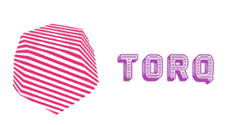
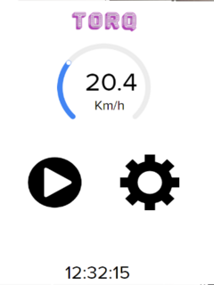
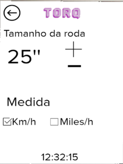
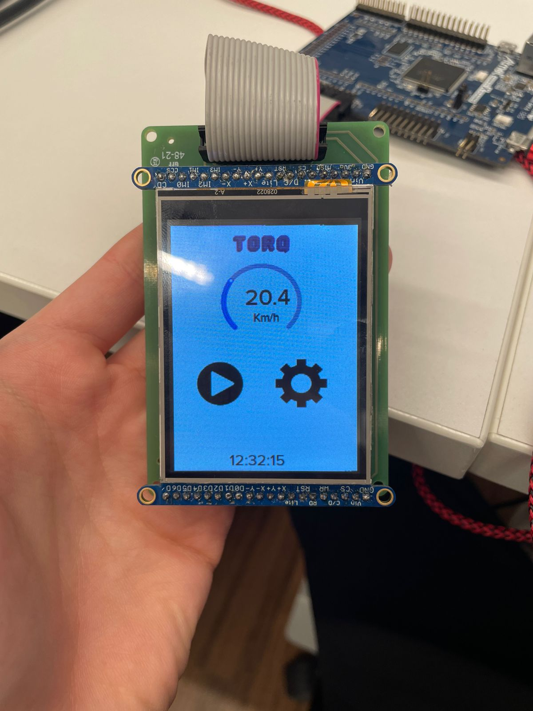
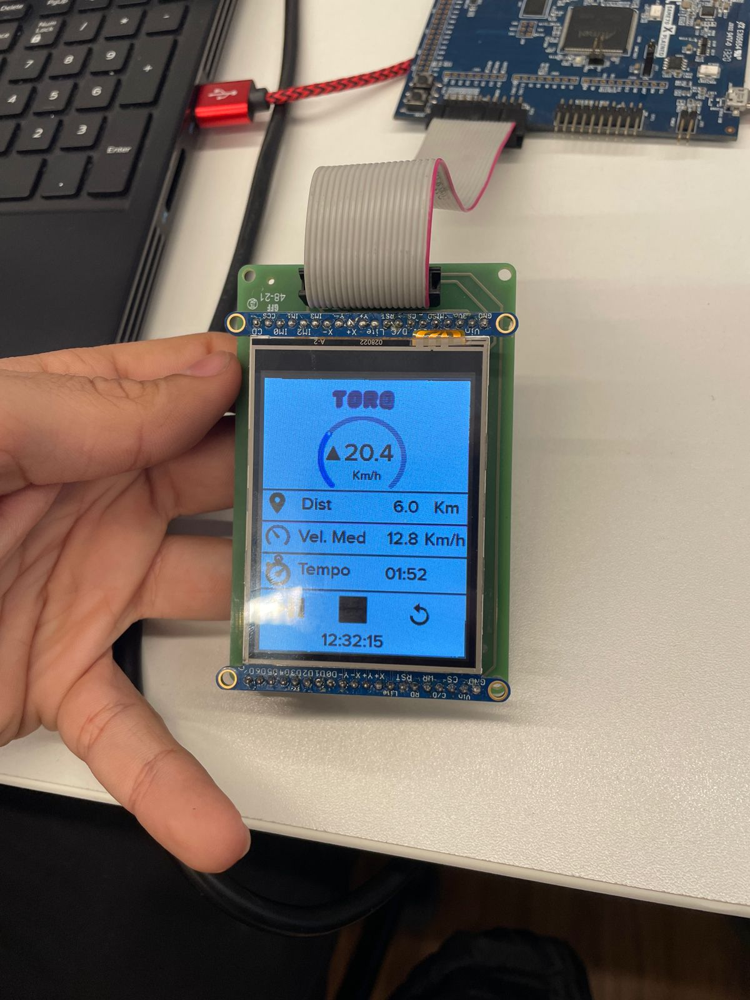
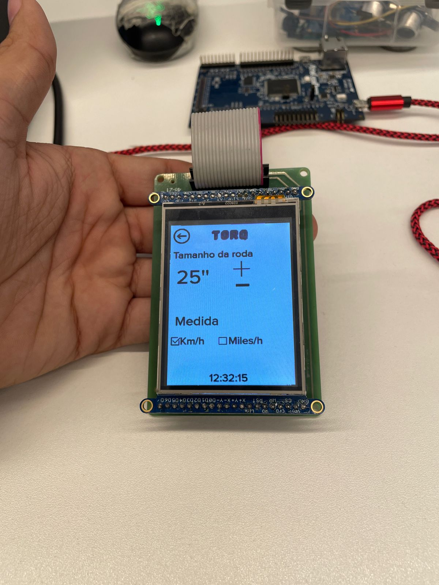
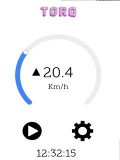
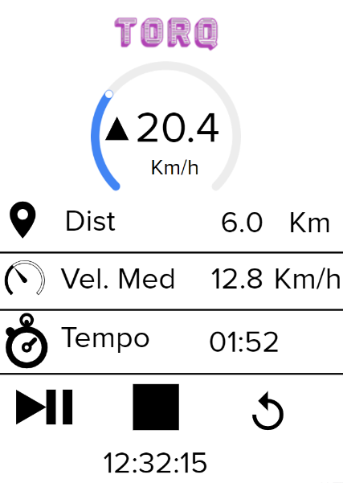

# 21b - APS2 - Embarcados

O marketing de uma empresa de equipamentos esportivos quer criar um novo ciclocomputador e você foi escolhido como desenvolvedor autônomo, dado seu background técnico e de UX, para criar um protótipo e validar a ideia.

Mais detalhes no site da disciplina:

- https://insper.github.io/ComputacaoEmbarcada/navigation/APS/APS-2-Bike/Descricao/

## Detalhes

Integrantes:

- Pedro Altobelli Teixeira Pinto 
- Willian Kenzo
- Arthur Carvalho

Nome da marca:

## Interface

### Proposta UX 1 - C

> - Mockup da interface:
>    - Satisfaz todos os requisitos do projeto
>    - Indica quais são os widgets do LVGL 
>    - Apresentar uma foto da interface sendo executada no LCD (imagem estática)
> - Grava um vídeo explicando a interface

Descricão da primeira proposta da interface:

- Imagem da proposta
            
 <table>
  <tr>
   <td> Tela 1: </td>
    <td> Tela 2: </td>
     <td> Tela 3: </td>
   </tr> 
  <tr>
    <td> </td>
    <td> </td>
     <td> </td>
   </tr> 
</table>
        
  
        
- Imagem da proposta no LCD
<table>
  <tr>
   <td> Tela 1: </td>
    <td> Tela 2: </td>
     <td> Tela 3: </td>
   </tr> 
  <tr>
    <td> </td>
    <td> </td>
     <td> </td>
   </tr> 
</table>
  
- Vídeo explicando a interface:
    [This is an external link to genome.gov](https://www.genome.gov/)

### Proposta UX 2 - B

> - Especifica e justifica quais vão ser as fontes (e tamanhos) a serem usadas na interface.
> - Pega feedback com o Luiz do Fablab e incorpora na interface
>   - Grava em vídeo a entrevista
> - Grava um vídeo atualizado explicando o que foi sugerido e o que fizeram para melhorar a interface
> - Apresentar uma foto da interface sendo executada no LCD (imagem estática)

- #### Fonte

A fonte escolhida foi a *Museo Slab*, uma fonte com serifa para um visual mais clássico que não prejudica a leitura, além disso foi escolhida uma fonte com um tamanho que não impede a visualização da tela pelo ciclista durante seu trajeto, mesmo se estiver em uma velocidade elevada

Detalhes da segunda interação da proposta de interface:

<!-- 
 Adicionar texto descrevendo a evolução 
 da interface
-->

- Imagem da proposta

<table>
  <tr>
   <td> Tela 1: </td>
    <td> Tela 2: </td>
     <td> Tela 3: </td>
   </tr> 
  <tr>
    <td> </td>
    <td> </td>
     <td> </td>
   </tr> 
</table>

- Imagem da proposta no LCD
    - Vídeo da entrevista com o Luis do Fablab
    - Vídeo atualizado explicando o que foi sugerido e o que fizemos para melhorar a interface:
- Vídeo

### Proposta UX 3 - A

> - Especifica e justifica as cores a serem usadas na interface
> - Pega feedback com mais uma pessoa externa e incorpora na interface
>     - Grava em vídeo a entrevista
> - Grava um vídeo atualizado explicando o que foi sugerido e o que fizeram para melhorar a interface
> - Apresentar uma foto da interface sendo executada no LCD (imagem estática)

Detalhes da terceira interação da proposta de interface:

<!-- 
 Adicionar texto descrevendo a evolução 
 da interface
-->

- Imagem da proposta
- Imagem da proposta no LCD
- Vídeo 
